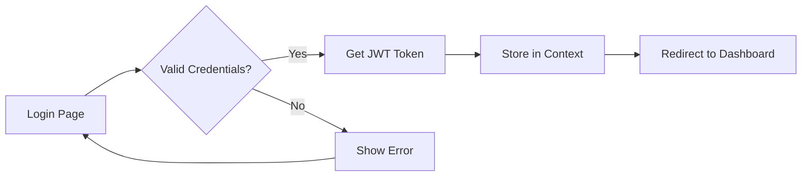

# 🎨 AI Interview Platform - Frontend

A modern, feature-rich React + TypeScript frontend application for AI-powered interview management with comprehensive role-based access control, GDPR compliance, and advanced interview features.

---

## 📋 Table of Contents

- [Overview](#overview)
- [Features](#features)
- [Tech Stack](#tech-stack)
- [Quick Start](#quick-start)
- [Installation](#installation)
- [Configuration](#configuration)
- [Project Structure](#project-structure)
- [User Roles & Access](#user-roles--access)
- [Key Features](#key-features)
- [Development](#development)
- [Build & Deployment](#build--deployment)
- [Troubleshooting](#troubleshooting)

---

## 🎯 Overview

The AI Interview Platform Frontend is a comprehensive React application built with TypeScript, providing an intuitive interface for managing the entire interview lifecycle. It features role-based dashboards, AI-powered question generation, video interviews, GDPR compliance tools, and advanced analytics.

### What Makes It Special

- **🎨 Modern UI/UX**: Clean, responsive design with smooth animations
- **🔐 Role-Based Access**: Different experiences for Candidates, Recruiters, Domain Experts, and Admins
- **🤖 AI Integration**: Seamless integration with AI services for question generation and scoring
- **📹 Video Interviews**: Built-in Zoom integration for virtual interviews
- **🔒 GDPR Compliant**: Complete data privacy management tools
- **📊 Real-time Analytics**: Live dashboards and performance tracking
- **♿ Accessible**: WCAG-compliant components and keyboard navigation

---

## ✨ Features

### Core Features

#### 🔐 Authentication & Authorization
- Secure JWT-based authentication
- Role-based access control (RBAC)
- Protected routes with automatic redirects
- Session management
- Password reset functionality

#### 💼 Job Management
- Create and publish job postings
- Advanced job search and filtering
- Skills-based job matching
- Application tracking
- Job analytics and statistics

#### 👥 Candidate Management
- Resume upload and parsing
- Candidate profile management
- Application history tracking
- Candidate-job matching scores
- Status management workflow

#### 🤖 AI Question Generation
- Gemini AI-powered question creation
- Skill-based question customization
- Gold standard answer management
- Question approval workflow
- Multi-level difficulty settings

#### 🎥 Video Interviews
- Zoom integration for virtual interviews
- Interview scheduling and management
- Recording access and playback
- Real-time interview monitoring
- Candidate consent management

#### 🔒 GDPR & Data Privacy
- Consent management dashboard
- Data export requests (JSON, CSV)
- Right to be forgotten
- Privacy notice display
- Audit log viewing (Admin)
- Data retention policy management

#### 📊 ATS Integration
- Applicant Tracking System features
- Pipeline management
- Candidate stage tracking
- Sync with external ATS platforms
- Job mapping configuration

#### 🚨 Fraud Detection
- Real-time fraud monitoring
- Behavioral analysis
- Flag management
- Fraud analytics dashboard
- Alert notifications

#### 📈 Post-Hire Feedback
- Performance tracking
- Quality metrics dashboard
- Feedback collection
- Scoring refinement
- Continuous improvement analytics

---

## 🛠️ Tech Stack

### Core Technologies
- **React** 18.2.0 - UI library
- **TypeScript** - Type-safe JavaScript
- **Vite** 4.1.0 - Build tool and dev server
- **React Router DOM** 6.8.0 - Client-side routing

### UI Libraries
- **Material-UI (MUI)** 7.3.7 - Component library
- **@mui/icons-material** 7.3.7 - Icon set
- **@emotion/react** & **@emotion/styled** - CSS-in-JS styling
- **Lucide React** 0.263.1 - Additional icons
- **FontAwesome** 6.4.0 - Icon library

### State Management & API
- **Axios** 1.3.0 - HTTP client
- **React Context API** - Global state management
- **React Hot Toast** 2.6.0 - Toast notifications

### Development Tools
- **@vitejs/plugin-react** 3.1.0 - Vite React plugin
- **TypeScript** - Type checking
- **ESLint** - Code linting (configured)

---

## 🚀 Quick Start

### Prerequisites
- **Node.js** 16+ or higher
- **npm** or **yarn**
- Backend server running (see backend README)

### Installation

```bash
# Navigate to frontend directory
cd Frontend

# Install dependencies
npm install

# Start development server
npm run dev
```

The application will open at: **http://localhost:5173**

---

## 📦 Installation

### Step-by-Step Setup

1. **Clone the repository**
   ```bash
   git clone <repository-url>
   cd ai-interview-platform/Frontend
   ```

2. **Install dependencies**
   ```bash
   npm install
   ```

3. **Set up environment variables**
   ```bash
   # Copy example environment file
   cp .env.example .env
   
   # Edit .env with your configuration
   ```

4. **Configure API endpoint**
   ```env
   VITE_API_BASE_URL=http://localhost:8000
   ```

5. **Start development server**
   ```bash
   npm run dev
   ```

6. **Open in browser**
   - Navigate to: http://localhost:5173

---

## ⚙️ Configuration

### Environment Variables

Create a `.env` file in the Frontend directory:

```env
# ============================================
# API CONFIGURATION
# ============================================
VITE_API_BASE_URL=http://localhost:8000

# ============================================
# ZOOM CONFIGURATION (Optional)
# ============================================
VITE_ZOOM_SDK_KEY=your-zoom-sdk-key
VITE_ZOOM_SDK_SECRET=your-zoom-sdk-secret

# ============================================
# FEATURE FLAGS (Optional)
# ============================================
VITE_ENABLE_GDPR=true
VITE_ENABLE_VIDEO_INTERVIEWS=true
VITE_ENABLE_FRAUD_DETECTION=true
VITE_ENABLE_ATS_INTEGRATION=true

# ============================================
# ANALYTICS (Optional)
# ============================================
VITE_GOOGLE_ANALYTICS_ID=your-ga-id
VITE_SENTRY_DSN=your-sentry-dsn
```

### API Configuration

The frontend communicates with the backend via REST APIs. The base URL is configured through the `VITE_API_BASE_URL` environment variable.

**Default Development Setup:**
- Frontend: `http://localhost:5173`
- Backend: `http://localhost:8000`

**Production Setup:**
```env
VITE_API_BASE_URL=https://api.yourdomain.com
```

---

## 🏗️ Project Structure

```
Frontend/
├── public/                    # Static assets
│   └── vite.svg              # Favicon
│
├── src/                       # Source code
│   ├── components/           # React components
│   │   ├── auth/            # Authentication components
│   │   │   ├── signIn.tsx
│   │   │   └── signUp.tsx
│   │   ├── dashboard/       # Dashboard components
│   │   │   └── Dashboard.tsx
│   │   ├── jobs/            # Job management components
│   │   │   ├── Jobs_new.tsx
│   │   │   ├── JobCreation.tsx
│   │   │   ├── JobDetails.tsx
│   │   │   └── JobSearch.tsx
│   │   ├── candidates/      # Candidate management
│   │   │   ├── Candidates.tsx
│   │   │   ├── CandidateUpload.tsx
│   │   │   ├── CandidateMatching.tsx
│   │   │   └── CandidateProfile.tsx
│   │   ├── interview/       # Interview components
│   │   │   ├── AIQuestionGeneration.tsx
│   │   │   ├── InterviewOutline.tsx
│   │   │   ├── Interview.tsx
│   │   │   └── Results.tsx
│   │   ├── video/           # Video interview components
│   │   │   ├── VideoInterviewScheduler.tsx
│   │   │   ├── VideoInterviewList.tsx
│   │   │   ├── VideoInterviewRoom.tsx
│   │   │   ├── VideoInterviewDetail.tsx
│   │   │   └── CandidateVideoConsent.tsx
│   │   ├── gdpr/            # GDPR compliance components
│   │   │   ├── ConsentManager.tsx
│   │   │   ├── DataExportPage.tsx
│   │   │   ├── DeletionRequestPage.tsx
│   │   │   ├── PrivacyNotice.tsx
│   │   │   ├── AdminAuditLog.tsx
│   │   │   ├── AdminRetentionPolicies.tsx
│   │   │   └── AdminDeletionRequests.tsx
│   │   ├── ats/             # ATS integration components
│   │   │   ├── ATSSettings.tsx
│   │   │   ├── ATSSyncDashboard.tsx
│   │   │   └── ATSJobMappings.tsx
│   │   ├── fraud/           # Fraud detection components
│   │   │   ├── FraudDashboard.tsx
│   │   │   ├── FraudAnalysisPanel.tsx
│   │   │   └── RealTimeFlagMonitor.tsx
│   │   ├── feedback/        # Post-hire feedback components
│   │   │   ├── FeedbackForm.tsx
│   │   │   ├── FeedbackList.tsx
│   │   │   ├── FeedbackDetail.tsx
│   │   │   ├── QualityDashboard.tsx
│   │   │   ├── PerformanceTracker.tsx
│   │   │   └── ScoringRefinementPanel.tsx
│   │   ├── recruiter/       # Recruiter-specific components
│   │   │   └── RecruiterCandidates.tsx
│   │   ├── layout/          # Layout components
│   │   │   ├── Navigation.tsx
│   │   │   └── profile.tsx
│   │   └── common/          # Shared components
│   │       ├── RoleProtectedRoute.tsx
│   │       ├── LoadingSpinner.tsx
│   │       └── ErrorBoundary.tsx
│   │
│   ├── contexts/             # React Context providers
│   │   └── AuthContext.tsx  # Authentication context
│   │
│   ├── services/             # API service layer
│   │   ├── api.ts           # Axios instance configuration
│   │   ├── authService.ts   # Authentication APIs
│   │   ├── jobService.ts    # Job management APIs
│   │   ├── candidateService.ts
│   │   ├── interviewService.ts
│   │   ├── videoService.ts
│   │   ├── gdprService.ts
│   │   ├── atsService.ts
│   │   ├── fraudService.ts
│   │   └── feedbackService.ts
│   │
│   ├── types/                # TypeScript type definitions
│   │   └── index.ts         # Shared types and interfaces
│   │
│   ├── utils/                # Utility functions
│   │   ├── roleUtils.ts     # Role-based utilities
│   │   └── formatters.ts    # Data formatting utilities
│   │
│   ├── constants/            # Application constants
│   │   └── roles.ts         # Role definitions
│   │
│   ├── assets/               # Static assets (images, fonts)
│   │
│   ├── App.tsx               # Main application component
│   ├── main.tsx              # Application entry point
│   └── index.css             # Global styles
│
├── index.html                # HTML template
├── package.json              # Dependencies and scripts
├── tsconfig.json             # TypeScript configuration
├── vite.config.ts            # Vite configuration
├── .env                      # Environment variables (not in git)
├── .env.example              # Example environment file
└── README.md                 # This file
```

---

## 👥 User Roles & Access

The application provides different experiences based on user roles:

### 🎓 Candidate (Level 1)

**Access:**
- ✅ View and apply for jobs
- ✅ Upload resume
- ✅ Take interviews
- ✅ View own application status
- ✅ Manage GDPR preferences
- ✅ Request data export/deletion
- ✅ Join video interviews

**Default Route:** `/jobs`

**Key Features:**
- Job search and application
- Interview participation
- Profile management
- Privacy controls

---

### 💼 Recruiter (Level 2)

**Access:**
- ✅ All Candidate permissions +
- ✅ Create and manage jobs
- ✅ View all applications
- ✅ Upload candidates
- ✅ Review candidate profiles
- ✅ Update candidate status
- ✅ Schedule video interviews
- ✅ View ATS integration
- ✅ Monitor fraud detection

**Default Route:** `/dashboard`

**Key Features:**
- Job posting management
- Candidate pipeline
- Application tracking
- Interview scheduling
- Recruiter analytics

---

### 🎯 Domain Expert (Level 3)

**Access:**
- ✅ All Recruiter permissions +
- ✅ Generate AI questions
- ✅ Approve interview questions
- ✅ Review interview answers
- ✅ Evaluate candidate performance
- ✅ Access quality metrics

**Default Route:** `/dashboard`

**Key Features:**
- AI question generation
- Question approval workflow
- Interview evaluation
- Technical assessment
- Quality assurance

---

### 👑 Admin (Level 4)

**Access:**
- ✅ All permissions +
- ✅ User management
- ✅ System settings
- ✅ View audit logs
- ✅ Manage retention policies
- ✅ Handle deletion requests
- ✅ Configure ATS integration
- ✅ Scoring refinement

**Default Route:** `/dashboard`

**Key Features:**
- Full system access
- User administration
- GDPR compliance management
- System configuration
- Advanced analytics

---

## 🎨 Key Features

### Authentication Flow



**Implementation:**
- JWT token stored in AuthContext
- Automatic token refresh
- Protected routes with redirect
- Role-based route access

### Dashboard

Each role sees a customized dashboard:

**Candidate Dashboard:**
- Applied jobs
- Interview schedule
- Application status
- Profile completion

**Recruiter Dashboard:**
- Active jobs
- Pending applications
- Interview pipeline
- Quick actions

**Domain Expert Dashboard:**
- Questions pending approval
- Interview evaluations
- Quality metrics
- Recent assessments

**Admin Dashboard:**
- System overview
- User statistics
- GDPR requests
- System health

### Job Management

**Features:**
- Create job postings with rich details
- Advanced search and filtering
- Skills-based matching
- Application tracking
- Status management

**Job Creation Form:**
```typescript
interface JobFormData {
  title: string;
  description: string;
  company: string;
  location: string;
  salary_range: string;
  job_type: 'Full-time' | 'Part-time' | 'Contract';
  work_mode: 'Remote' | 'Hybrid' | 'On-site';
  experience_level: 'Entry' | 'Mid' | 'Senior';
  department: string;
  skills_required: string[];
}
```

### AI Question Generation

**Workflow:**
1. Select job and skills
2. AI generates questions
3. Domain expert reviews
4. Approve/reject/modify
5. Questions added to pool

**Features:**
- Skill-based generation
- Difficulty levels
- Gold standard answers
- Bulk approval
- Question bank management

### Video Interviews

**Zoom Integration:**
- Create meetings via API
- Send invitations
- Join from browser
- Recording management
- Transcript analysis

**Interview Room Features:**
- Real-time video/audio
- Screen sharing
- Chat functionality
- Recording indicator
- Integrity checks

### GDPR Compliance

**Candidate Tools:**
- **Consent Manager**: Manage data processing consent
- **Data Export**: Download personal data (JSON/CSV)
- **Deletion Request**: Right to be forgotten
- **Privacy Notice**: View data policies

**Admin Tools:**
- **Audit Log**: Track all data access
- **Retention Policies**: Configure data lifecycle
- **Deletion Requests**: Approve/process requests
- **Compliance Reports**: GDPR compliance status

### Fraud Detection

**Monitoring:**
- Real-time behavioral analysis
- Multiple person detection
- Tab switching detection
- Copy-paste detection
- Unusual patterns

**Dashboard:**
- Fraud score overview
- Flag management
- Incident timeline
- Risk assessment
- Alert configuration

---

## 💻 Development

### Available Scripts

```bash
# Start development server
npm run dev

# Build for production
npm run build

# Preview production build
npm run preview

# Run linter
npm run lint

# Run tests (if configured)
npm run test
```

### Development Server

```bash
npm run dev
```

**Features:**
- Hot Module Replacement (HMR)
- Fast refresh
- TypeScript type checking
- Auto-reload on changes

**Access:**
- Local: http://localhost:5173
- Network: http://[your-ip]:5173

### Adding New Features

#### 1. Create Component

```typescript
// src/components/feature/NewFeature.tsx
import React from 'react';

const NewFeature: React.FC = () => {
  return (
    <div>
      <h1>New Feature</h1>
    </div>
  );
};

export default NewFeature;
```

#### 2. Add Route

```typescript
// src/App.tsx
import NewFeature from './components/feature/NewFeature';

// In Routes:
<Route path="/new-feature" element={
  <ProtectedRoute>
    <RoleProtectedRoute allowedRoles={['admin']}>
      <NewFeature />
    </RoleProtectedRoute>
  </ProtectedRoute>
} />
```

#### 3. Add Service

```typescript
// src/services/newService.ts
import api from './api';

export const getNewData = async () => {
  const response = await api.get('/api/new-endpoint');
  return response.data;
};
```

#### 4. Update Navigation

```typescript
// src/components/layout/Navigation.tsx
// Add new menu item based on role
```

### Code Style Guidelines

**TypeScript:**
- Use interfaces for props
- Avoid `any` type
- Use type inference where possible
- Export types from `types/index.ts`

**React:**
- Functional components with hooks
- Use React.FC for component types
- Extract complex logic to custom hooks
- Keep components focused and small

**Naming Conventions:**
- Components: PascalCase (e.g., `UserProfile.tsx`)
- Services: camelCase (e.g., `authService.ts`)
- Constants: UPPER_SNAKE_CASE
- Utilities: camelCase

**File Organization:**
- Group by feature, not by type
- Keep related files together
- Use index files for exports
- Separate concerns (UI, logic, data)

---

## 🚀 Build & Deployment

### Production Build

```bash
# Build for production
npm run build

# Output directory: dist/
```

**Build Output:**
- Optimized JavaScript bundles
- Minified CSS
- Compressed assets
- Source maps (optional)

### Preview Production Build

```bash
npm run preview
```

### Environment-Specific Builds

**Development:**
```bash
npm run dev
```

**Staging:**
```env
# .env.staging
VITE_API_BASE_URL=https://staging-api.yourdomain.com
```

```bash
npm run build -- --mode staging
```

**Production:**
```env
# .env.production
VITE_API_BASE_URL=https://api.yourdomain.com
```

```bash
npm run build -- --mode production
```

### Deployment Options

#### 1. Static Hosting (Vercel, Netlify)

```bash
# Build
npm run build

# Deploy dist/ folder
```

**Vercel:**
```bash
npm install -g vercel
vercel --prod
```

**Netlify:**
```bash
npm install -g netlify-cli
netlify deploy --prod --dir=dist
```

#### 2. Docker

```dockerfile
# Dockerfile
FROM node:18-alpine as build

WORKDIR /app
COPY package*.json ./
RUN npm ci

COPY . .
RUN npm run build

FROM nginx:alpine
COPY --from=build /app/dist /usr/share/nginx/html
COPY nginx.conf /etc/nginx/nginx.conf

EXPOSE 80
CMD ["nginx", "-g", "daemon off;"]
```

```bash
# Build and run
docker build -t ai-interview-frontend .
docker run -p 80:80 ai-interview-frontend
```

#### 3. AWS S3 + CloudFront

```bash
# Build
npm run build

# Upload to S3
aws s3 sync dist/ s3://your-bucket-name

# Invalidate CloudFront cache
aws cloudfront create-invalidation --distribution-id YOUR_DIST_ID --paths "/*"
```

### Production Checklist

- [ ] Update `VITE_API_BASE_URL` to production API
- [ ] Enable production mode
- [ ] Configure CORS on backend
- [ ] Set up SSL/HTTPS
- [ ] Configure CDN for assets
- [ ] Enable gzip compression
- [ ] Set up error tracking (Sentry)
- [ ] Configure analytics (Google Analytics)
- [ ] Test all user flows
- [ ] Verify role-based access
- [ ] Check mobile responsiveness
- [ ] Optimize images and assets
- [ ] Enable caching headers
- [ ] Set up monitoring and alerts

---

## 🐛 Troubleshooting

### Common Issues

#### 1. API Connection Failed

**Problem:** `Network Error` or `CORS policy` errors

**Solution:**
```env
# Check .env file
VITE_API_BASE_URL=http://localhost:8000

# Verify backend is running
curl http://localhost:8000/api/health

# Check CORS settings in backend
```

#### 2. Build Errors

**Problem:** `Module not found` or TypeScript errors

**Solution:**
```bash
# Clear node_modules and reinstall
rm -rf node_modules package-lock.json
npm install

# Clear Vite cache
rm -rf node_modules/.vite
npm run dev
```

#### 3. Authentication Issues

**Problem:** Redirect loop or "Unauthorized" errors

**Solution:**
```typescript
// Clear local storage
localStorage.clear();

// Check token expiration
// Verify backend JWT settings match
```

#### 4. Route Not Found

**Problem:** 404 on refresh in production

**Solution:**
```nginx
# nginx.conf
location / {
  try_files $uri $uri/ /index.html;
}
```

#### 5. Environment Variables Not Working

**Problem:** `undefined` when accessing `import.meta.env.VITE_*`

**Solution:**
```bash
# Ensure variable starts with VITE_
VITE_API_BASE_URL=http://localhost:8000

# Restart dev server after changing .env
npm run dev
```

#### 6. Slow Development Server

**Problem:** HMR slow or not working

**Solution:**
```typescript
// vite.config.ts
export default defineConfig({
  server: {
    hmr: {
      overlay: false
    }
  },
  optimizeDeps: {
    include: ['react', 'react-dom']
  }
});
```

### Debug Mode

Enable detailed logging:

```typescript
// src/services/api.ts
import axios from 'axios';

const api = axios.create({
  baseURL: import.meta.env.VITE_API_BASE_URL
});

// Request interceptor for debugging
api.interceptors.request.use(
  (config) => {
    console.log('Request:', config.method?.toUpperCase(), config.url);
    return config;
  },
  (error) => {
    console.error('Request Error:', error);
    return Promise.reject(error);
  }
);

// Response interceptor for debugging
api.interceptors.response.use(
  (response) => {
    console.log('Response:', response.status, response.config.url);
    return response;
  },
  (error) => {
    console.error('Response Error:', error.response?.status, error.config.url);
    return Promise.reject(error);
  }
);
```

---

## 🧪 Testing

### Manual Testing

**Test User Flows:**

1. **Authentication**
   - Sign up new user
   - Login with credentials
   - Logout and verify redirect
   - Access protected routes

2. **Job Management**
   - Create new job
   - Search and filter jobs
   - Apply for job
   - View application status

3. **Interview Flow**
   - Generate questions
   - Approve questions
   - Take interview
   - View results

4. **GDPR Features**
   - Update consent
   - Request data export
   - Submit deletion request
   - View privacy notice

### Browser Testing

Test on multiple browsers:
- ✅ Chrome (latest)
- ✅ Firefox (latest)
- ✅ Safari (latest)
- ✅ Edge (latest)
- ✅ Mobile browsers

### Responsive Testing

Test on different screen sizes:
- 📱 Mobile (320px - 480px)
- 📱 Tablet (481px - 768px)
- 💻 Desktop (769px - 1024px)
- 🖥️ Large Desktop (1025px+)

---

## 📚 Resources

### Documentation
- [React Documentation](https://react.dev/)
- [TypeScript Documentation](https://www.typescriptlang.org/docs/)
- [Vite Documentation](https://vitejs.dev/)
- [Material-UI Documentation](https://mui.com/)
- [React Router Documentation](https://reactrouter.com/)

### Tools
- [React DevTools](https://chrome.google.com/webstore/detail/react-developer-tools/)
- [Redux DevTools](https://chrome.google.com/webstore/detail/redux-devtools/)
- [Axios Documentation](https://axios-http.com/)

---

## 📞 Support

### Getting Help

1. Check this README for common issues
2. Review browser console for errors
3. Verify backend is running and accessible
4. Check environment variables are set correctly
5. Ensure dependencies are installed
6. Try clearing cache and rebuilding

### Useful Commands

```bash
# Clear all caches
rm -rf node_modules/.vite dist

# Reinstall dependencies
rm -rf node_modules package-lock.json
npm install

# Check for outdated packages
npm outdated

# Update dependencies
npm update
```

---

## 🎉 Success Indicators

You'll know everything is working when:

✅ **Development server starts** without errors

✅ **Login page loads** at http://localhost:5173/login

✅ **Authentication works** and redirects to dashboard

✅ **API calls succeed** and data displays correctly

✅ **Role-based routing works** (different users see different pages)

✅ **Toast notifications appear** for user actions

✅ **No console errors** in browser DevTools

---

## 📄 License

This project is a demo application intended for evaluation and prototyping purposes.

---

**Built with ❤️ using React, TypeScript, and Material-UI**